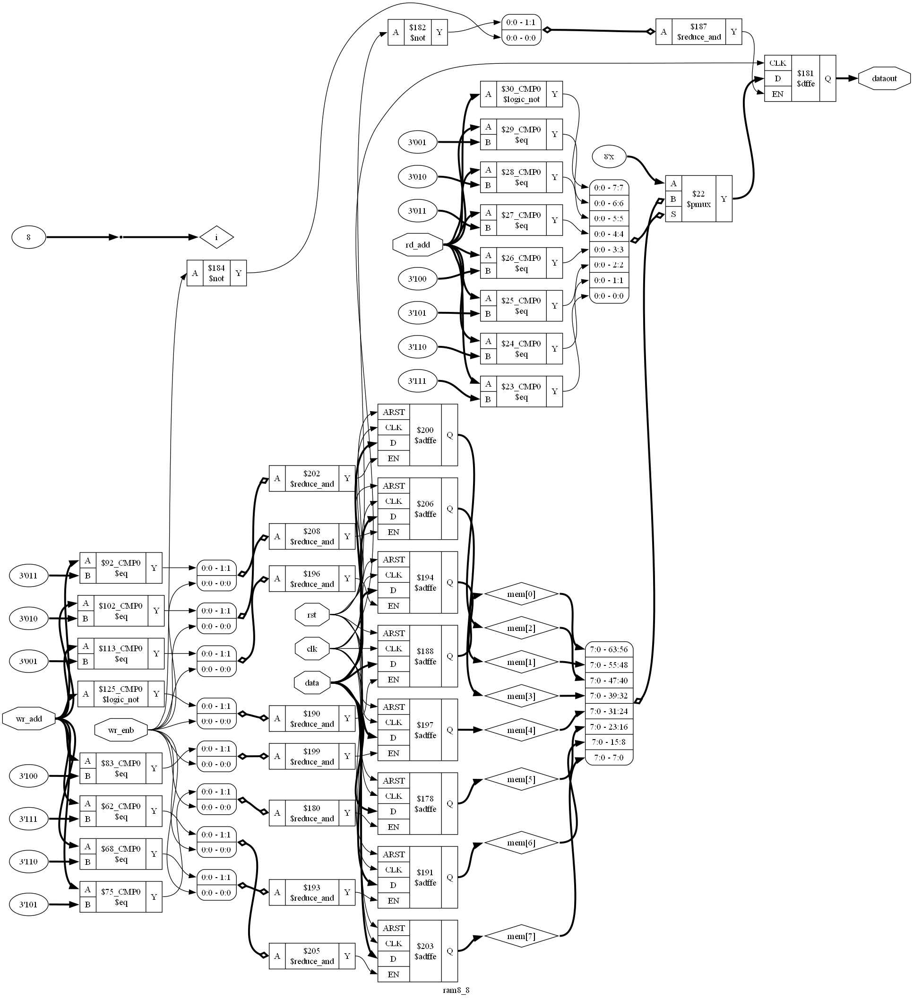
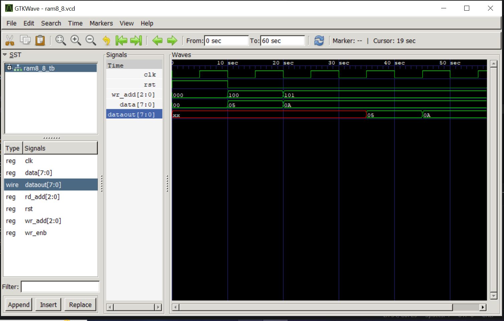

# 8×8 RAM using Verilog HDL

## Project Overview

This project implements an **8×8 Single-Port RAM** using **Verilog HDL**.

The RAM supports:
- Synchronous Write
- Synchronous Read
- Asynchronous Reset

---

## Specifications

| Feature | Description |
|---------|-------------|
| Memory Size | 8 × 8 |
| Data Width | 8 bits |
| Address Width | 3 bits |
| Read | Synchronous |
| Write | Synchronous |
| Reset | Asynchronous |

---

## Tools Used

- Verilog HDL
- Visual Studio Code
- Icarus Verilog
- GTKWave
- Yosys
- Graphviz

---

## Project Files

| File | Description |
|------|-------------|
| `ram8_8.v` | Verilog source code |
| `ram8_8_tb.v` | Testbench |
| `show.png` | RTL schematic generated by Yosys |
| `ramwaveform.png` | Simulation waveform |

---

## RTL Schematic

---

## Simulation Waveform

---

## Author

**Gopika Sujana**

B.Tech Electronics and Communication Engineering

Learning RTL Design and Verilog HDL
